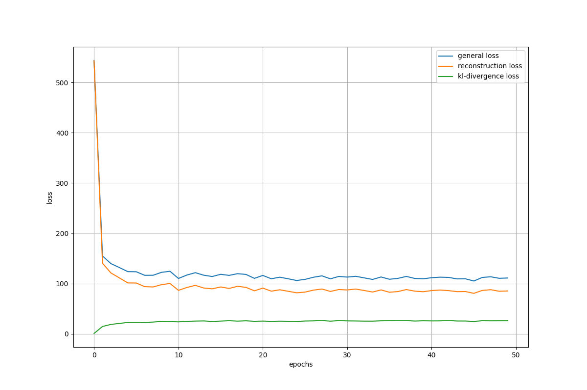
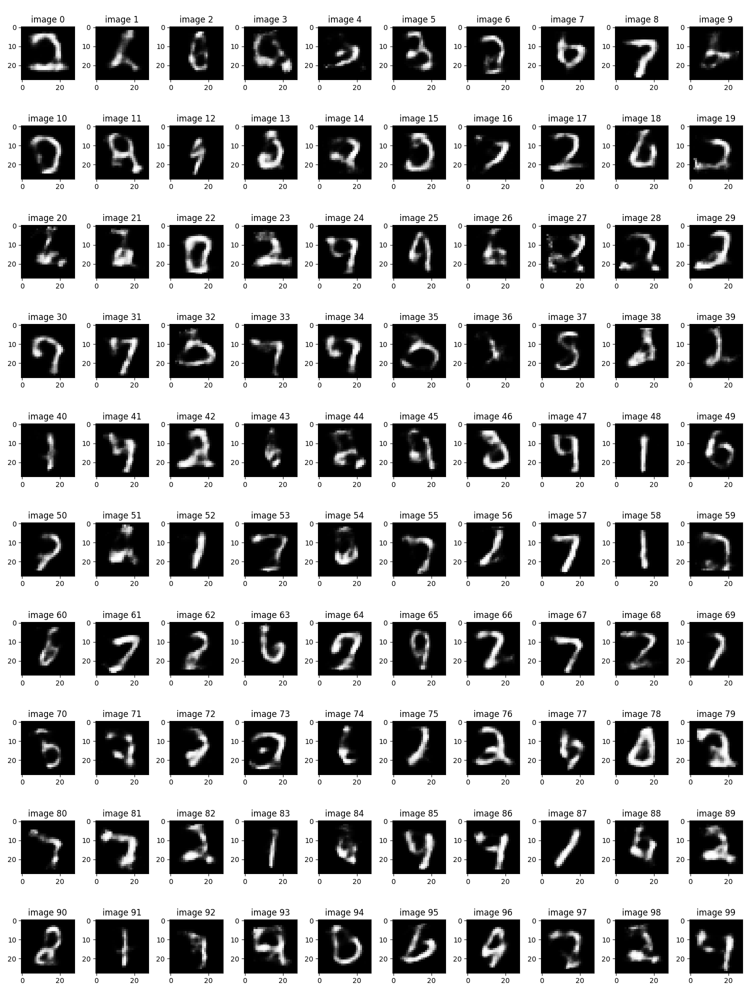

#### Implementation of VAE where the encoder is an LSTM and the decoder is a CNN

Dependencies:
* Python 3.7.10
* tensorflow:  1.15.2
* numpy:  1.19.5
* matplotlib:  3.2.2

Please, add the data file in it and organize them in this way:
```
./
├── checkpoint
├── model.index
├── model.meta
├── model.data-00000-of-00001
├── generator.py
├── main.py
└── model.py
```
## main.py
        
Run main.py in a Python IDE or the terminal by typing ```python main.py```

This will train the network using a batch size of 100 and a learning rate of 0.001.
It will stop after training 50 epoches.
During training, at each epoch, it will train the model on batches (one batch at a time).
It will generate general loss, reconstuction loss (bce loss) and regularization term (kl-divergence) loss for each epoch.

It will save the trained model in "new_model" (new_model.data, new_model.index, new_model.meta, checkpoints).

It will save loss convergence curves.

## model.py

Our VAE architecture, loss function and optimizer are in this python file. We call this from main.py and generator.py.

## generator.py

Run generator.py in a Python IDE or the terminal by typing ```python generator.py```

It will take trained decoder of our model and generate new 100 images from random vectors.

It will save generated images.

## An example of output

main.py:
```
----------------------------------------------------------------------------------------------------
batch_size =  100
hidden_dim =  64
epoch_number =  50
learning_rate =  0.001
----------------------------------------------------------------------------------------------------
-> Session is started.
----- Encoder -----
input hidden_dim:  64
input x:  (?, 28, 28)
lstm:  (?, 28, 64)
flatten_lstm:  (?, 1792)
mu:  (?, 64)
sigma:  (?, 64)
epsilon:  (?, 64)
z:  (?, 64)
----- Decoder -----
input z:  (?, 64)
1. fc:  (?, 98)
2. fc:  (?, 196)
2. reshaped_fc:  (?, 14, 14, 1)
3. tconv:  (?, 14, 14, 64)
3. dropout:  (?, 14, 14, 64)
4. tconv:  (?, 14, 14, 32)
4. dropout:  (?, 14, 14, 32)
5. tconv:  (?, 28, 28, 32)
5. flatten_tconv:  (?, 25088)
6. fc:  (?, 784)
6. reshaped_output:  (?, 28, 28)

-> Session is started.
-> Training is started.
|--- Epoch: 0 	---> General loss: 544.42 | Reconstruction loss: 543.92 | KL-divergence loss: 0.50
|--- Epoch: 1 	---> General loss: 161.11 | Reconstruction loss: 147.25 | KL-divergence loss: 13.87
|--- Epoch: 2 	---> General loss: 142.25 | Reconstruction loss: 125.10 | KL-divergence loss: 17.15
|--- Epoch: 3 	---> General loss: 137.21 | Reconstruction loss: 117.48 | KL-divergence loss: 19.73
|--- Epoch: 4 	---> General loss: 127.70 | Reconstruction loss: 106.70 | KL-divergence loss: 21.00
|--- Epoch: 5 	---> General loss: 117.77 | Reconstruction loss: 96.19 | KL-divergence loss: 21.58
|--- Epoch: 6 	---> General loss: 124.18 | Reconstruction loss: 102.23 | KL-divergence loss: 21.95
|--- Epoch: 7 	---> General loss: 121.00 | Reconstruction loss: 98.91 | KL-divergence loss: 22.09
|--- Epoch: 8 	---> General loss: 121.01 | Reconstruction loss: 98.75 | KL-divergence loss: 22.27
|--- Epoch: 9 	---> General loss: 118.71 | Reconstruction loss: 96.16 | KL-divergence loss: 22.55
|--- Epoch: 10 	---> General loss: 113.52 | Reconstruction loss: 91.43 | KL-divergence loss: 22.09
|--- Epoch: 11 	---> General loss: 112.84 | Reconstruction loss: 89.42 | KL-divergence loss: 23.42
|--- Epoch: 12 	---> General loss: 119.34 | Reconstruction loss: 96.17 | KL-divergence loss: 23.17
|--- Epoch: 13 	---> General loss: 115.37 | Reconstruction loss: 92.30 | KL-divergence loss: 23.08
|--- Epoch: 14 	---> General loss: 119.78 | Reconstruction loss: 95.68 | KL-divergence loss: 24.10
|--- Epoch: 15 	---> General loss: 117.03 | Reconstruction loss: 94.09 | KL-divergence loss: 22.94
|--- Epoch: 16 	---> General loss: 117.15 | Reconstruction loss: 93.79 | KL-divergence loss: 23.36
|--- Epoch: 17 	---> General loss: 118.99 | Reconstruction loss: 95.34 | KL-divergence loss: 23.65
|--- Epoch: 18 	---> General loss: 113.62 | Reconstruction loss: 89.81 | KL-divergence loss: 23.81
|--- Epoch: 19 	---> General loss: 115.63 | Reconstruction loss: 92.35 | KL-divergence loss: 23.27
|--- Epoch: 20 	---> General loss: 112.12 | Reconstruction loss: 88.61 | KL-divergence loss: 23.51
|--- Epoch: 21 	---> General loss: 111.11 | Reconstruction loss: 87.46 | KL-divergence loss: 23.65
|--- Epoch: 22 	---> General loss: 112.28 | Reconstruction loss: 89.23 | KL-divergence loss: 23.05
|--- Epoch: 23 	---> General loss: 118.28 | Reconstruction loss: 94.35 | KL-divergence loss: 23.93
|--- Epoch: 24 	---> General loss: 114.50 | Reconstruction loss: 90.29 | KL-divergence loss: 24.20
|--- Epoch: 25 	---> General loss: 114.11 | Reconstruction loss: 89.54 | KL-divergence loss: 24.56
|--- Epoch: 26 	---> General loss: 112.77 | Reconstruction loss: 88.87 | KL-divergence loss: 23.90
|--- Epoch: 27 	---> General loss: 108.20 | Reconstruction loss: 85.33 | KL-divergence loss: 22.88
|--- Epoch: 28 	---> General loss: 115.03 | Reconstruction loss: 91.25 | KL-divergence loss: 23.78
|--- Epoch: 29 	---> General loss: 111.51 | Reconstruction loss: 88.13 | KL-divergence loss: 23.38
|--- Epoch: 30 	---> General loss: 114.07 | Reconstruction loss: 90.12 | KL-divergence loss: 23.95
|--- Epoch: 31 	---> General loss: 105.98 | Reconstruction loss: 82.85 | KL-divergence loss: 23.12
|--- Epoch: 32 	---> General loss: 109.22 | Reconstruction loss: 85.68 | KL-divergence loss: 23.54
|--- Epoch: 33 	---> General loss: 114.68 | Reconstruction loss: 90.72 | KL-divergence loss: 23.96
|--- Epoch: 34 	---> General loss: 110.91 | Reconstruction loss: 86.95 | KL-divergence loss: 23.96
|--- Epoch: 35 	---> General loss: 105.06 | Reconstruction loss: 82.51 | KL-divergence loss: 22.55
|--- Epoch: 36 	---> General loss: 109.57 | Reconstruction loss: 85.25 | KL-divergence loss: 24.32
|--- Epoch: 37 	---> General loss: 109.44 | Reconstruction loss: 85.67 | KL-divergence loss: 23.77
|--- Epoch: 38 	---> General loss: 114.02 | Reconstruction loss: 90.02 | KL-divergence loss: 23.99
|--- Epoch: 39 	---> General loss: 110.70 | Reconstruction loss: 86.21 | KL-divergence loss: 24.50
|--- Epoch: 40 	---> General loss: 110.45 | Reconstruction loss: 87.01 | KL-divergence loss: 23.44
|--- Epoch: 41 	---> General loss: 112.28 | Reconstruction loss: 87.69 | KL-divergence loss: 24.60
|--- Epoch: 42 	---> General loss: 109.26 | Reconstruction loss: 85.17 | KL-divergence loss: 24.09
|--- Epoch: 43 	---> General loss: 112.18 | Reconstruction loss: 88.29 | KL-divergence loss: 23.89
|--- Epoch: 44 	---> General loss: 112.54 | Reconstruction loss: 88.25 | KL-divergence loss: 24.30
|--- Epoch: 45 	---> General loss: 109.22 | Reconstruction loss: 85.50 | KL-divergence loss: 23.72
|--- Epoch: 46 	---> General loss: 108.87 | Reconstruction loss: 84.93 | KL-divergence loss: 23.93
|--- Epoch: 47 	---> General loss: 115.12 | Reconstruction loss: 90.54 | KL-divergence loss: 24.59
|--- Epoch: 48 	---> General loss: 109.43 | Reconstruction loss: 85.96 | KL-divergence loss: 23.47
|--- Epoch: 49 	---> General loss: 110.98 | Reconstruction loss: 86.77 | KL-divergence loss: 24.21
-> Plot of loss curves are saved.
-> Model is saved.
-> Session is ended.
```
Loss curves:
<p align="center"></p>

generator.py:
```
----- Encoder -----
input hidden_dim:  64
input x:  (?, 28, 28)
lstm:  (?, 28, 64)
flatten_lstm:  (?, 1792)
mu:  (?, 64)
sigma:  (?, 64)
epsilon:  (?, 64)
z:  (?, 64)
----- Decoder -----
input z:  (?, 64)
1. fc:  (?, 98)
2. fc:  (?, 196)
2. reshaped_fc:  (?, 14, 14, 1)
3. tconv:  (?, 14, 14, 64)
3. dropout:  (?, 14, 14, 64)
4. tconv:  (?, 14, 14, 32)
4. dropout:  (?, 14, 14, 32)
5. tconv:  (?, 28, 28, 32)
5. dropout:  (?, 28, 28, 32)
5. flatten_tconv:  (?, 25088)
6. fc:  (?, 784)
6. reshaped_output:  (?, 28, 28)
-> Checkpoints are restored from model
-> Generation is started.
-> Generated images are saved in generated_images.png
```
Generated 100 images from random vectors:
<p align="center"></p>

## References

"Mnist handwritten digit database, yann lecun, corinna cortes and chris burges." http://yann:lecun:com/exdb/mnist/. (Accessed on 06/12/2021).

S. Paul, ""reparameterization" trick in variational autoencoders," Apr 2020.

"Lecture 13 | generative models - youtube." https://www:youtube:com/watch?v=5WoItGTWV54. (Accessed on 06/12/2021).

"Understanding variational autoencoders (vaes) | by joseph rocca | towards data science."https://towardsdatascience:com/understanding-variational-autoencoders-vaes-f70510919f73. (Accessed on 06/12/2021).

X. Guo, X. Liu, E. Zhu, and J. Yin, "Deep clustering with convolutional autoencoders," in International conference on neural information processing, pp. 373-382, Springer, 2017.

A. Asperti and M. Trentin, "Balancing reconstruction error and kullback-leibler divergence in variational autoencoders," IEEE Access, vol. 8, pp. 199440-199448, 2020.

B. Dai and D. Wipf, "Diagnosing and enhancing vae models," arXiv preprint arXiv:1903.05789,2019.

"tensorflow-mnist-vae/mnist vae.ipynb at master · charlesd1ng/tensorflow-mnist-vae." https://github:com/CharlesD1ng/tensorflow-mnist-vae/blob/master/mnistvae:ipynb. (Accessed on 06/13/2021).

##### This project was implemented for CmpE 597 Deep Learning Course of Bogazici University.
